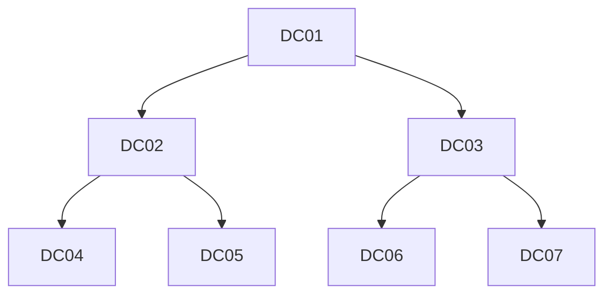

 

# **DCSync Attack**

A DCSync attack uses commands in Microsoft Directory Replication Service Remote Protocol (MS-DRSR) to pretend to be a domain controller (DC) in order to get user credentials from another DC.

Large-scale networks require many DCs to function, and each of those DCs need to have up-to-date information. That requires a function allowing one DC to update another DC on any changes, like updated credential information.

Active Directory relies on **Directory Replication Service (DRS)** to keep domain controllers (DCs) synchronized, here's how it does:

- An admin modifies an object on DC01.
- DC1 records the change in its **NTDS.dit database** and marks the object as needing replication.
- **DC1 notifies its direct replication partners** (usually 2-3 other DCs)
- Each notified DC (DC2, DC3) then requests changes, applies changes to their own NTDS.dit.
- Then notifies their own direct replication partners (DC4, DC5) (DC6, DC7)





### **How Does the DC Sync Attack Work?**

- An attacker obtains or abuses an account with “Replicating Directory Changes” permissions. 
- Mimicking a Domain Controller, using tools like Mimikatz or Impacket, the attacker simulates a domain controller and sends replication requests to the target DC.
- The target DC, trusting the request as legitimate, provides the requested directory information, including sensitive credentials like password hashes and Kerberos tickets.
- The attacker uses the extracted credentials for further attacks, such as Pass-the-Hash, lateral movement, or privilege escalation.


These groups **automatically** have replication privileges:

| Group                                      | Permissions                         |
| ------------------------------------------ | ----------------------------------- |
| **Domain Controllers** (computer accounts) | Full replication rights             |
| **Enterprise Domain Controllers**          | `Replicating Directory Changes`     |
| **Administrators**                         | `Replicating Directory Changes All` |
| **Domain Admins**                          | `Replicating Directory Changes All` |
| **Enterprise Admins**                      | `Replicating Directory Changes All` |

<br>
<br>

| Permission Level                      | What Attackers Can Do                                           |
| ------------------------------------- | --------------------------------------------------------------- |
| **Replicating Directory Changes**     | Read most AD objects (but not password hashes)                  |
| **Replicating Directory Changes All** | Full DCSync - Extract **NTLM/Kerberos hashes** including krbtgt |
| **Default DC computer accounts**      | Can perform DCSync (by design)                                  |

<br>

An attacker only needs to compromise:
1. Any account with `Replicating Directory Changes` and  `Replicating Directory Changes All`
2. Any member of Domain/Enterprise Admins.
3. Over-permissioned service accounts like backup service account.


```
secretsdump.py -target-ip 192.168.29.145 infra.local/'DC01$'@dc01.infra.local -hashes :63bc1591b6b1354e0679950c46bef65e
```

- Performing DCsync using DC Computer Account


